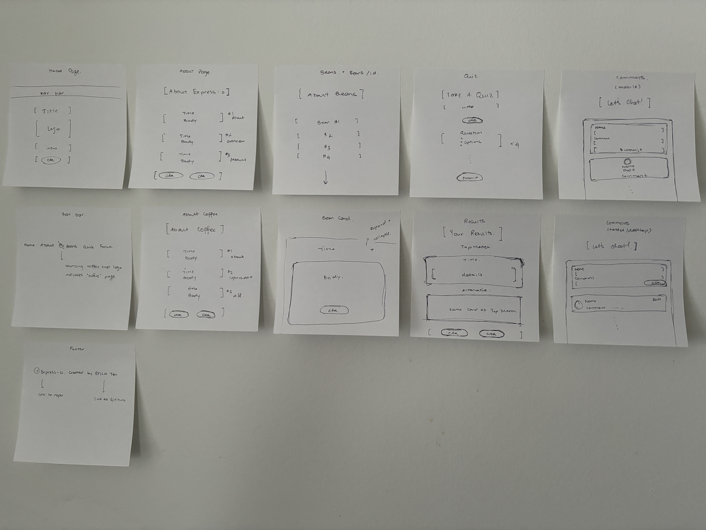

# Express-o

The title is a play on the word _espresso_, which is commonly mispronounced as _ex-press-o_, and embodies what I hope this app will achieve: an _express_ path into the world of coffee.

## Overview

This app is to help users learn about different types of coffee varieties and coffee drinks. Users can learn about different varieties and types of coffee, and take a quiz to receive a recommendation based on their preferences.

### Problem

When coffee is brought up in a casual conversation, most people don't even know that there are different roast levels (i.e. light, medium, dark, etc.). They know that there are different brands of coffee, and some may know about different roast levels, but that is usually the limit of their knowledge. As an avid coffee lover, I want to create an app that is easy to use and provides guidance for people who have no knowledge about coffee, and would like to explore the wonderful world of coffee. When I first started my coffee journey, there weren't any sites that had the functionality that I wanted, and I learned most of what I know from watching hours of YouTube videos. I hope Express-o is able to make this hobby more accessible to those who may not want to go down the rabbit hole, but want to learn just enough to appreciate coffee at a deeper level.

### User Profile

Anyone with an interest in coffee can use the app. They will be able to access the app on any device via web browser.

### Features

- Users can browse through the app to learn about coffee, such as origins, varieties, flavours, etc.
- Quiz to determine their preferences for coffee (i.e. nutty vs fruity, sour vs rich, etc.), where at the end they are given a recommendation for a type of coffee
- Users can interact with each other in the forum by leaving comments

## Installation

Run `npm install` to install all the required packages

- If packages are missing, manually install the following for the front-end:
  - `npm i axios`
  - `npm i tailwindcss`
  - `npm i daisyui@latest`
- These are for the back-end:
  - `npm i express`
  - `npm i knex`
  - `npm i mysql2`

Once all the `node_modules` have been installed, run `npm start` to mount the React app, and run `node index.js` to start the server. 
Once the server is running, run `npm migrate` to run the migrations, then run `npm seed` to seed the database.

## Implementation

### Tech Stack

- React
- Tailwind CSS
- Daisy UI
- Node
- Express
- Knex
- mySQL

### APIs

All APIs are contained in the backend server.

### Sitemap

Home Page

- App name, logo, and navigation

About Express-o Page

- About Express-o, overview, features

About Coffee Page

- What is coffee, roast levels, differences in roasts

Beans Page

- General information about different coffee types
- One card for each type/variety of coffee
- Clicking on a card will navigate to detailed information about that coffee

Quiz Page

- Users answer each question based on their personal preferences
- Users will be shown a recommendation at the end, where they can click a button to learn more

Forum Page

- Users can interact with each other via comments

### Mockup



### Data

Coffee table:

- coffee_id (primary key)
- coffee_type
- history
- region
- countries
- acidity
- flavour
- roast_profile

Quiz Questions table:

- question_id (primary key)
- question

Quiz Response table: each response is associated with a quiz question

- response_id (primary key)
- question_id (foreign key)
- option
- coffee_ids

Comments table:

- comment_id (primary key)
- name
- date (milliseconds since epoch)
- comment
- avatar

### Endpoints

#### Coffee:

`GET /coffee` : returns array of all coffee information

Response body example:

```
[
    {
        "coffee_id": 1,
        "coffee_type": "Arabica",
        "region": "Central America",
        "history": "Arabica coffee is believed to have originated in the highlands of Ethiopia and spread throughout the Middle East, eventually making its way to Europe and the Americas. Today, it is the most widely cultivated species of coffee in the world and is highly valued for its delicate flavour and aroma.",
        "countries": "Guatemala, Honduras, El Salvador, Costa Rica, Panama, Mexico",
        "acidity": "moderate",
        "flavour": "fruity, sweet",
        "roast_profile": "light to medium"
    },
    {
        "coffee_id": 2,
        "coffee_type": "Arabica",
        "region": "South America",
        "history": "Arabica coffee is believed to have originated in the highlands of Ethiopia and spread throughout the Middle East, eventually making its way to Europe and the Americas. Today, it is the most widely cultivated species of coffee in the world and is highly valued for its delicate flavour and aroma.",
        "countries": "Brazil, Colombia, Peru, Ecuador, Bolivia",
        "acidity": "low",
        "flavour": "nutty, chocolatey",
        "roast_profile": "light to medium"
    },
]
```

`GET /coffee/:id` : returns object with detailed information for one type of coffee

Response body example:

```
{
    "coffee_id": 2,
    "coffee_type": "Arabica",
    "region": "South America",
    "history": "Arabica coffee is believed to have originated in the highlands of Ethiopia and spread throughout the Middle East, eventually making its way to Europe and the Americas. Today, it is the most widely cultivated species of coffee in the world and is highly valued for its delicate flavour and aroma.",
    "countries": "Brazil, Colombia, Peru, Ecuador, Bolivia",
    "acidity": "low",
    "flavour": "nutty, chocolatey",
    "roast_profile": "light to medium"
}
```

#### Quiz Questions:

`GET /questions` : returns array of all quiz questions

Response body example:

```
[
    {
        "question_id": 1,
        "question": "Do you prefer bold and strong flavours, or mild and less strong flavours?"
    },
    {
        "question_id": 2,
        "question": "Which flavours do you enjoy more: nutty and chocolatey, fruity and floral, or woody and earthy?"
    },
]
```

`GET /questions/:id` : returns question object by id

Response body example:

```
{
    "question_id": 1,
    "question": "Do you prefer bold and strong flavours, or mild and less strong flavours?"
}
```

#### Quiz Responses:

`GET /responses` : returns array of all responses

Response body example:

```
[
    {
        "response_id": 1,
        "question_id": 1,
        "option": "mild",
        "coffee_ids": "1,2,3,4,5"
    },
    {
        "response_id": 2,
        "question_id": 1,
        "option": "medium",
        "coffee_ids": "1,2,3,4,5,9,10"
    },
]
```

`GET /responses/:id` : returns response object by id

Response body example:

```
{
    "response_id": 4,
    "question_id": 2,
    "option": "fruity, floral",
    "coffee_ids": "1,3,4,5,9,10"
}
```

Results:

`POST /results` : filters response and returns recommendation

Request body example:

```
{
    "1": {
        "response_id": 3,
        "question_id": 1,
        "option": "bold",
        "coffee_ids": "6,7,8,9"
    },
    "2": {
        "response_id": 4,
        "question_id": 2,
        "option": "fruity, floral",
        "coffee_ids": "1,3,4,5,9,10"
    },
}
```

Response body example:

```
[
    {
        "coffee_id": 9,
        "coffee_type": "Liberica",
        "region": "West Africa, Central Africa",
        "history": "Liberica coffee is native to West and Central Africa and was introduced to Southeast Asia during the colonial period. It is a lesser-known species of coffee, but is valued for its unique flavour profile.",
        "countries": "Liberia, Sierra Leone",
        "acidity": "moderate",
        "flavour": "fruity, floral, smoky, woody",
        "roast_profile": "medium to dark"
    }
]
```

#### Comments:

`GET /comments` : returns array of all comments

Response body example:

```
[
    {
        "comment_id": "3061484f-077e-4c3d-8e6b-fff74264cc85",
        "name": "Joan Fawn",
        "avatar": "https://img.daisyui.com/tailwind-css-component-profile-4@56w.png",
        "comment": "I'm excited to try out some new beans!",
        "date": "2024/05/02"
    },
    {
        "comment_id": "ca84e3e9-5378-42fc-9404-aaa65142eadd",
        "name": "John Deer",
        "avatar": "https://img.daisyui.com/tailwind-css-component-profile-2@56w.png",
        "comment": "This comment section is a nice touch!",
        "date": "2024/04/26"
    },
]
```

`POST /comments` : add new comment

Request body example:

```
{
    "name": "Luna",
    "comment": "meow meow",
}
```

Response body example:

```
{
    "comment_id": "7e30d3c8-0beb-465d-99e1-0490b2468bb9",
    "name": "Luna",
    "comment": "meow meow",
    "date": 1715056086475,
    "avatar": null
}
```

### Auth

Auth will be added if time permits. Users can create a profile and log in using a username and password. JSON Web Tokens will be used for authentication.

## Roadmap

Build structure of the app

- Create React app, generate all required assets for the project, build out file structure for front end (2)
- Create backend using Node, build out file structure for back end (2)

Build the back end

- Create mySQL database (3)
- Use Knex.js migrations to create table for storing information in the database (5)
- Create API endpoints using Express.js (5)

Build the front end

- Create structure for each page and component (5)
- Map out routes and paths for each page & components (2)
- Use Axios to make requests to backend (3)
- Implement logic to handle form submissions and process data returned from the backend (5)

## Nice-to-haves

- Forums with comment threads for user interactions
- Users can create a profile and log in using a username and password. JSON Web Tokens will be used for authentication.
- Deeper dive into drinks, grinders, grind size, brewing methods, temperatures, etc.
- Map to find coffee shops near you
